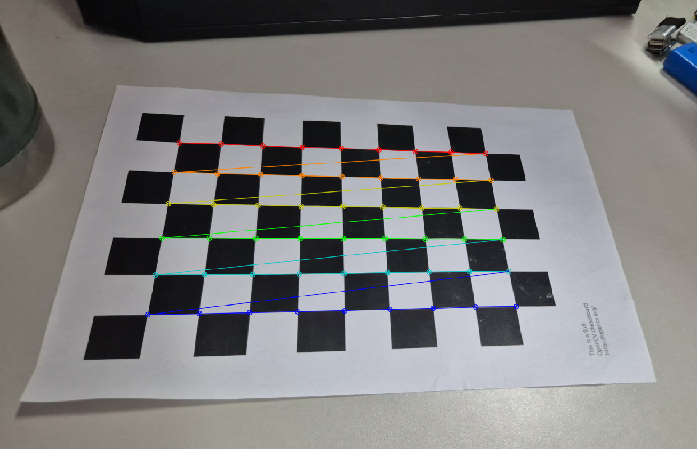
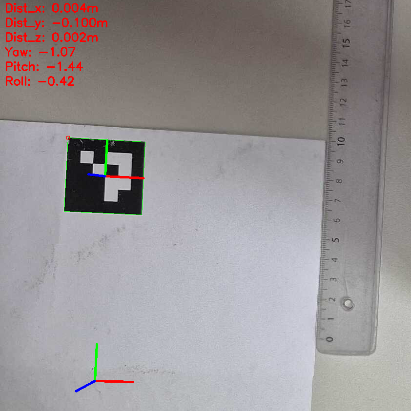
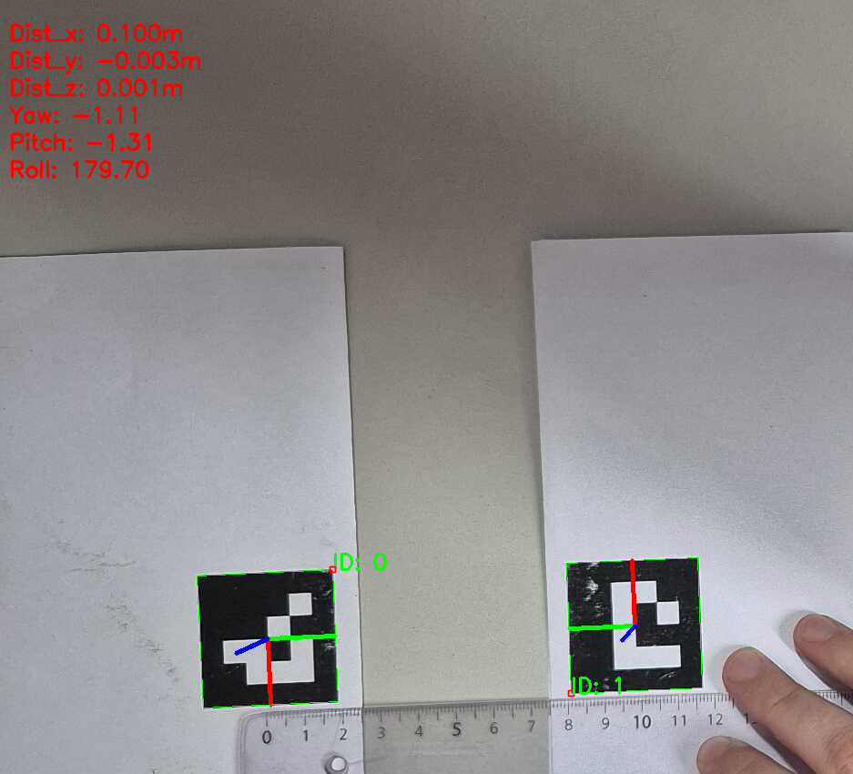

# Aruco pose verification

Este proyecto se utiliza para estimar el desplazamiento de un marker utilizando aruco. Para utilizarlo se deben realizar los siguientes pasos:

## 1. Calibración de la camara
Se debe descargar e imprimir una imágen similar a un tablero de ajedrez proporcionado por OpenCV, sacar múltiples fotografías de él utilizando la camara y guardarlas en el directorio `images`.

Luego editar los campos iniciales del script `camera_calibration.py` y ejecutarlo. Generará dos archivos `calibration_matrix.npy` y `distortion_coefficients.npy` que describen los parámetros de la cámara.

Las imágenes capturadas no deben ser procesadas posteriormente (proceso que algunos smartphones realizan) ya que generarán parámetros incorrectos.

Los archivos de calibración presentes en este repositorio pertenecen a la camara de un S24.

## 2. Estimar el desplazamiento
Para estimar el desplazamiento del marker en el espacio se debe ejecutar el script `pose_estimation.py`. Se puede utiilizar de dos formas:

- En tiempo real, utilizando por ejemplo la IP de la cámara.
- Desde un archivo de video.

Ambas configuraciones se deben editar en el script.

Además existe otro script `pose_estimation_two_markers.py` que estima la distancia entre dos markers.

